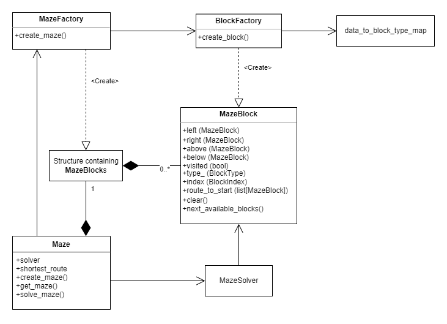

# Pena Got Stuck in a Maze

### This repository contains a Python demonstration/solution for the following task:

Pentti got stuck in a maze.

Implement an algorithm to find a route through a maze given in a .txt file, or
tell if there is no possible route available.

In the map file a ‘#’ represents a block, ‘ ‘ (whitespace) represents movable space
and ‘E’ means an exit. ‘^’ is the starting position. Going outside the maze
area is not allowed.

Pentti can move in 4 directions, and each move has an equal cost. Each map
should be tried with the same algorithm with 20, 150 and 200 maximum
moves.

The solution with the correct route must be printed to something visible, either to a file, on
the command line, or graphically. The optimal solution is not required, but bonus points for
providing it! The program should accept an input file given by the user.

Evaluation criteria:
- Design
- Structure
- Use of language features
- Clarity of implementation
- Error checking
- Comments
- Testability
- Documentation
- Usability

## Installation and Usage

1. Clone the repository.
2. Install Python 3.11 (and optionally create and activate a virtual environment).
3. Go to project root.
4. Run `pip install -r requirements.txt` to install the needed dependencies.
5. Run `python main.py` to run the program.

If you want to provide your own input file for another maze, put it in the "data" folder.

In order to run the unit tests, run: `pytest tests/` or `pytest tests\` depending on your OS.

## Architecture

Backend architecture is described roughly in the following image:

- MazeFactory is used for creating a structure of MazeBlocks (i.e. the maze).
- BlockFactory creates MazeBlocks by using data_to_block_type_map.
- MazeFactory uses the BlockFactory for the data given.
- Maze calls MazeFactory for the data given and stores the structure of MazeBlocks to itself.
- When Maze.solve_maze is called, Maze uses MazeSolver to solve the maze.
- MazeSolver stores the "route to start block" to each checked block and marks the blocks visited
while doing that to avoid the need for rechecking the blocks.
- While solving the maze, the MazeSolver calls next_available_blocks from the block it's inspecting.
- MazeBlock.next_available_blocks returns only the blocks that are not solid and have not yet been visited.
- Re-solving the maze starts with clearing all the internal data (except for the maze structure) of Maze and
MazeBlocks.
- Currently, only the structure of MazeBlocks and MazeBlocks themselves are destroyed and (re)created during
the program execution. Other objects are created only once.

The GUI architecture consists mainly of GUIApplication, Menu (layout), and Maze (layout).

- GUIApplication runs one layer at a time and passes information from layer to another when the layer
changes to a new one.
- Both layouts (Menu and Maze) have an instance of GUIBackendInterface, which they use for communicating with
Maze, MazeSolver, and a method that retrieves the available maze file names.
- The layouts use PySimpleGUI library.

## Thoughts and Possible Improvements

This code is over-kill solution to the given task. However, the purpose of this task is not to show that I
can solve it but rather to show what I can do with Python and how I do that (when I get way too excited).
There are things like MazeFileContext that are arguably not necessary, but on the other hand, I think that
as long as these things don't make the code base too complex, I shall do those just to showoff.

The code is built keeping in mind that adding support for creating mazes from different sources (other than
.txt) of data, adding different solvers, adding different factories, and extending the functionality would
be as easy as possible. However, there is a lot that could be improved.

- There could be an abstract MazeSolver (although, currently it being a callable, it kinda already is) so
more solvers could be created and those could be compared and switched during the execution.
- The GUI side code could be clearer (structurally).
- The GUI could be prettier (though I wouldn't be the one to make that happen).
- GUIBackendInterface could be divided into two one-directional interfaces.
- MazeSolver using GUI hook to inform about visited blocks isn't probably the best solution.
- Unit testing could be more thorough.
- Error handling could be better (custom errors, more error checking).
- A configuration management could be added (e.g. for configuring different characters for block creation).

In the end, however, the code needs to be "done" at some point and for now it is.

ps. A code review would have been nice.

## Development Related Information

- Python version used for development: Python 3.11.0
- Linting, type checking, and style checking:
  - Pylint
  - Flake8
  - Pydocstyle
  - Mypy (--strict)

